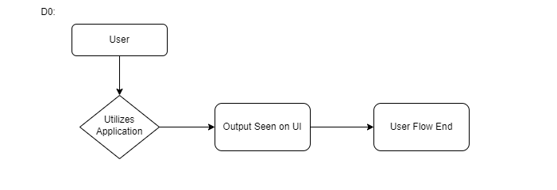
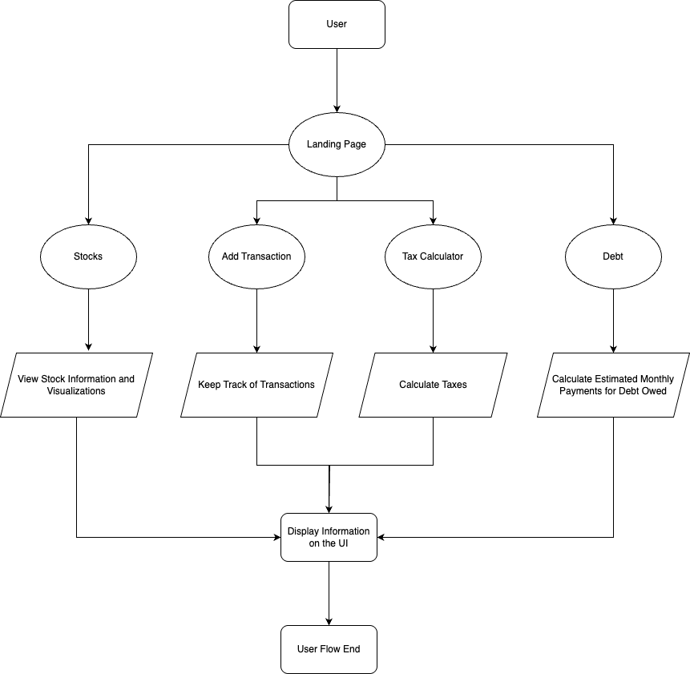
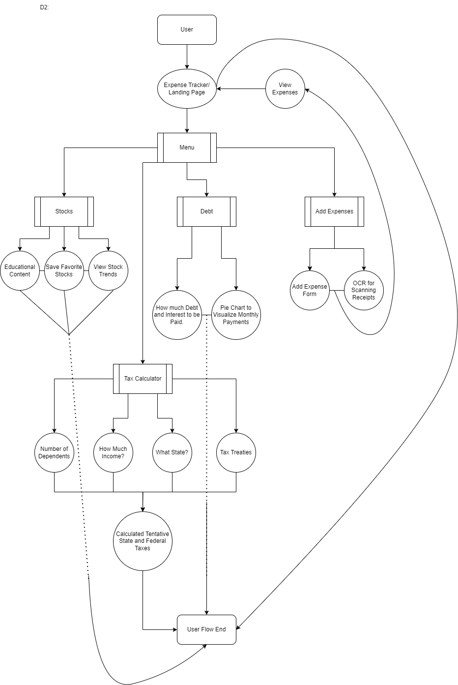

# Design Diagrams

## Project Title & Goal Statement

**Title:** FinTrackr \
**Goal Statement:** This project aims to provide an all-in-one financial solution that combines daily money management with long-term investment strategies.

 

## Diagrams

### D0

### D1

### D2

 

## Diagram Interpretation

- The rounded rectangles depict the start/end of the user interaction flow.
- The ellipses in diagram D1, and rectangles in diagram D2 depict the various pages that the user interacts with.
- The parallelograms in diagram D1 depict how a particular page is used.
- In diagram D2,  the ellipses/ovals represent each individual page the user visits, and the circles represent the functionality of the page/what the user would do on that particular page.
- The arrows (both solid and dotted) show the user interaction flow. The dotted arrows are just there to avoid any confusion about overlapping arrows.
