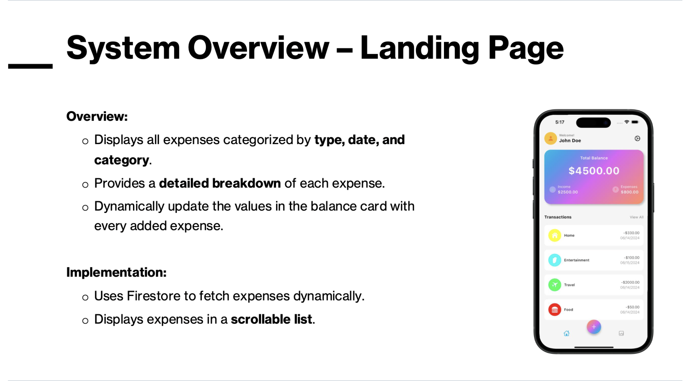

# FinTrackr

FinTrackr is a comprehensive personal finance management app designed to help users track their expenses, calculate their taxes, calculate interest owed on debts, and receive up-to-date stock market information.

## Table of Contents

- [FinTrackr](#fintrackr)
  - [Table of Contents](#table-of-contents)
  - [Team Budgeteers](#team-budgeteers)
    - [Team Advisor](#team-advisor)
    - [Team Members](#team-members)
  - [Project Abstract](#project-abstract)
  - [Project Description](#project-description)
  - [User Stories](#user-stories)
  - [Design Diagrams](#design-diagrams)
    - [D0](#d0)
    - [D1](#d1)
    - [D2](#d2)
  - [User Interface Specifications](#user-interface-specifications)
    - [System Overview](#system-overview)
    - [Landing Page](#landing-page)
    - [Add Expense](#add-expense)
    - [Stocks Page](#stocks-page)
    - [Debt Page](#debt-page)
    - [Taxes Page](#taxes-page)
  - [Test Plan \& Results](#test-plan--results)
  - [User Manual](#user-manual)
  - [Spring Final Presentation](#spring-final-presentation)
  - [Expo Poster](#expo-poster)
  - [Project Tasks \& Timeline](#project-tasks--timeline)
    - [Nehang's Tasks](#nehangs-tasks)
    - [Tharun's Tasks](#tharuns-tasks)
    - [Shruti's Tasks](#shrutis-tasks)
    - [Timeline](#timeline)
    - [Effort Matrix](#effort-matrix)
      - [Effort Scoring](#effort-scoring)
  - [ABET Concerns](#abet-concerns)
  - [Fall Design Presentation](#fall-design-presentation)
  - [Self Assessments](#self-assessments)
  - [Professional Biographies](#professional-biographies)
  - [Summary of Expenses](#summary-of-expenses)
  - [Appendix](#appendix)
  - [Contact](#contact)

## Team Budgeteers

### Team Advisor

- Dr. Nitin Nitin

### Team Members

- Nehang Patel

- Shruti Asolkar

- Tharun Swaminathan Ravi Kumar

## Project Abstract

This project develops a personal finance management app to help users manage expenses, calculate taxes, track debt, and improve budgeting. It also offers real-time stock market information. By integrating expense tracking, financial planning, and investment strategies, the app provides a holistic tool for effective personal finance management.

## Project Description

This project centers on creating a comprehensive personal finance application designed to empower users in managing their financial well-being. The application offers a user-friendly **Expense Tracker Landing Page** as the main interface, allowing users to efficiently manage and review their expenses. Key features include:

1. **Expense Management:**
   - Users can easily **add new transactions** via a form or through **OCR technology** for scanning receipts.
   - A dedicated **View Transactions** feature helps users track spending and identify patterns to improve financial habits.

2. **Stock Management:**
   - The app includes a **Stocks Module** offering:
     - **Educational content** to help users understand investment strategies.
     - Options to **save, filter, and favorite stocks** for quick access.
     - Tools to **view stock trends**, enabling informed decision-making.

3. **Debt Tracking:**
   - A **Debt Module** provides insights into:
     - **Outstanding debt and interest calculations**.
     - A **visual representation of monthly payments** using pie charts, simplifying debt management for users.
     - Ability for users to modify the debt duration to calculate accurate values of debt owed.

4. **Tax Calculation:**
   - The app integrates a **Tax Calculator** to guide users through tax planning, featuring:
     - Input fields for **number of dependents**, **annual income**, and **state of residence**.
     - Insights into **tax treaties** and regulations to ensure compliance.
     - Outputs **tentative state and federal tax calculations** to assist users with their tax obligations.

By combining these features, the app offers a **holistic personal finance tool** that blends daily expense management with long-term financial planning. The seamless integration of expense tracking, stock investment insights, debt monitoring, and tax planning equips users with the tools they need for a secure financial future.

## User Stories

We have identified the following User Stories for our app, FinTrackr:

1. As a **college student**, I want to manage my daily expenses along with my income so that I can save enough money for personal use, college and emergencies.
2. As a **9-5 working professional**, I want to stay informed about current stock trends so that I can make well-informed investments in stocks based on a detailed analysis by the application.
3. As a **freelancer**, I want to make passive income through investments while also learning about effective stock-trading strategies so that I can maintain a stable household income.
4. As a **debt-repayer**, I want to keep tracks of my debts, and set savings goals to repay all of my debts in time.

## Design Diagrams

### D0

The flowchart illustrates a simple user interaction process. It starts with the user deciding whether to utilize the application (decision point). If they do, the application generates an output that is displayed on the UI, concluding with the end of the user flow. The process follows a straightforward, linear path.

### D1

The diagram represents the user flow and system architecture for a personal finance management application, detailing the purpose of its components and conventions used. Rounded rectangles indicate the start and end of the user interaction flow, representing the entry and exit points of the system. Ellipses or ovals represent the primary modules that users interact with, such as "Stocks," "Add Expense," "Tax Calculator," and "Debt." Rectangles signify specific actions or functionalities within these modules, such as stock visualization, keeping track of expenses, inputting tax information, and accessing debt-related data. Arrows illustrate the flow of user interactions, connecting the components and guiding users through the application. The flow begins with the "Expense Tracker Landing Page," which serves as the central navigation hub, leading to different modules based on user needs. Each module outputs its data to the "Display on UI" component, which consolidates and presents information in a user-friendly format. The process concludes with the "User Flow End," marking the completion of the interaction. This diagram ensures a streamlined and intuitive navigation experience, with each component designed to enhance user accessibility and functionality while supporting effective financial management.

### D2

The diagram illustrates the flow and structure of our comprehensive personal finance management application, highlighting its components and conventions.

- **Rounded Rectangles:** Represent the start and end points of user interactions, such as entering or exiting the system.
- **Ellipses/Ovals:** Depict individual pages users interact with, including features like viewing expenses, adding new entries, and navigating financial tools.
- **Rectangles:** Represent major modules, such as Debt Management, Stock Management, and the Tax Calculator, acting as central hubs for related functionalities.
- **Circles:** Highlight specific actions or functionalities available on each page, such as calculating taxes or saving favorite stocks.
- **Parallelograms (in D1):** Indicate how particular pages are utilized.
- **Arrows:**
  - Solid arrows show the flow of user interactions.
  - Dotted arrows are used to avoid visual overlap and enhance clarity.

Key features illustrated in the diagram include:

- **OCR Module:** Scans receipts for automatic data extraction.
- **Debt Management Pie Chart:** Visualizes monthly payments for better understanding.
- **Stock Monitoring Tools:** Help users track trends and save favorite stocks.
- **Tax Calculator:** Estimates federal and state taxes based on user inputs.

The diagram integrates these components seamlessly, conveying a clear and user-friendly structure for the application. Each component is designed to enhance financial literacy, support informed decision-making, and improve the overall user experience.

## User Interface Specifications

### System Overview

### Landing Page

### Add Expense

### Stocks Page

### Debt Page

### Taxes Page

## Test Plan & Results

The test plan and results can be found on [this page.](./Spring%20Assignments/test_plan.md)

## User Manual

The user manual can be found by navigating to [this link.](https://opposite-hamster-e8c.notion.site/FinTrackr-User-Documentation-1c80e5dbb68e80a4a80ae95bc3993177)

## Spring Final Presentation

Our final Spring Presentation can be found [here.](./Senior%20Design%20Expo/Senior%20Design%20Spring%20Presentation.pdf)

## Expo Poster

Our Expo Poster can be found [here.](./Senior%20Design%20Expo/Expo%20Poster.pdf)

## Project Tasks & Timeline

### Nehang's Tasks

1. Refine the "Add Expenses" page and add a section to make notes about a transaction.
2. Design and develop the "Stocks" page UI.
3. Design and develop the UI for the "Debt" page.
4. Research and develop a list of debt-repayment educational content for the "Debt" page.
5. Implement user authentication for logging in/out or creating user accounts.

### Tharun's Tasks

1. Research, design, and develop the logic and code for OCR under the "Add Expenses" section.
2. Develop the mathematical formula and visualizations for the "Debt" page.
3. Develop the database API to pull data about tax percentages based on user inputs on the "Taxes" page.
4. Testing and Quality Assurance during development.
5. Implement the user account linking from the backend and updating the frontend based on it.

### Shruti's Tasks

1. Research stock trends and educational content for the "Stocks" page.
2. Design and implement pages for the different pending parts of the app.
3. Design the form for the "Tax Calculator" page.
4. Research chatbot integrations for the app.
5. Research and implement in-app notifications.

### Timeline

The provided timeline outlines the start and end dates for each task related to the milestones. It helps our team stay organized and ensures timely completion of project components.

|**Task**                                                                                      | **Start** | **End**   |
|------------------------------------------------------------------------------------------------|-----------|-----------|
| Refine the "Add Expenses" page and add a section to make notes about a transaction.    |   20 October 2024        |  23 October 2024         |
| Research the logic for OCR under "Add Expenses" section.  | 21 October 2024          |  26 October 2024         |
| Research stock trends and educational content for the "Stocks" page.                   |  20 October 2024         |    23 October 2024       |
| Design and develop the "Debt" page UI.                                                |     23 October 2024      |     31 October 2024      |
| Develop the mathematical formula and visualizations for the "Debt" page.               |   01 November 2024      |     10 November 2024      |
| Design and implement pages for the different pending parts of the app.                 |     24 October 2024      |     01 November 2024      |
| Design and develop the UI for the "Stocks" page.                                         |     01 November 2024      |      11 November 2024     |
| Design the form for the "Tax Calculator" page.                                          |     02 November 2024      |      12 November 2024     |
| Develop the database API to pull data about tax percentages based on user inputs on the "Taxes" page. |      13 November 2024     |     17 November 2024      |
| Research and develop list of debt-repayment educational content for the "Debt" page.    |     15 January 2025      |     19 January 2025      |
| Design and develop the logic and code for OCR under "Add Expenses" section.  | 20 January 2025          |  31 January 2025         |
| Research and implement in-app notifications.                                            |     15 January 2025      |      30 January 2025     |
| Research chatbot integrations for the app.                                              |      01 February 2025     |      10 February 2025     |
| Implement user authentication for logging in/out or creating user accounts.            |      20 January 2025     |      25 January 2025     |
| Implement user account linking from backend and update frontend based on it.           |      25 January 2025     |     15 February 2025      |
| Testing and Quality Assurance during development.                                      |    01 November 2024      |     28 February 2025      |

 

### Effort Matrix

The Effort Matrix outlines the tasks assigned to each team member, their associated effort scores, and the corresponding milestones. It provides a clear overview of who is responsible for what, making project management more efficient.

 

| **Team Member** | **Task**                                                                                      | **Effort (1-5)** | **Milestone**                                        |
|-----------------|------------------------------------------------------------------------------------------------|------------------|-----------------------------------------------------|
| **Nehang**      | Refine the "Add Expenses" page and add a section to make notes about a transaction.             | 3                | Development of "Add Expenses" page - OCR            |
|                 | Design and develop the UI for the "Stocks" page.                                                | 4                | Development of "Stocks" page - APIs, Notifications  |
|                 | Design and develop the UI for the "Debt" page.                                                  | 5                | Development of "Debt" page - Visualizations         |
|                 | Implement user authentication for logging in/out or creating user accounts.                     | 4                | Authentication and user persona development         |
|                 | Research and develop list of debt-repayment educational content for the "Debt" page.            | 3                | Development of "Debt" page - Visualizations         |
|                 | Testing and Quality Assurance during development (contribution).                                | 2                | Ongoing                                             |
| **Total Effort**|                                                                                                | **21**           |                                                     |

| **Team Member** | **Task**                                                                                      | **Effort (1-5)** | **Milestone**                                        |
|-----------------|------------------------------------------------------------------------------------------------|------------------|-----------------------------------------------------|
| **Tharun**      | Research, design, and develop the logic and code for OCR under "Add Expenses" section.           | 5                | Development of "Add Expenses" page - OCR            |
|                 | Develop the mathematical formula and visualizations for the "Debt" page.                        | 5                | Development of "Debt" page - Visualizations         |
|                 | Develop the database API to pull data about tax percentages based on user inputs on the "Taxes" page. | 4           | Development of "Tax" page - database APIs           |
|                 | Implement user account linking from backend and update frontend based on it.                    | 4                | Authentication and user persona development         |
|                 | Testing and Quality Assurance during development.                                               | 3                | Ongoing                                             |
| **Total Effort**|                                                                                                | **21**           |                                                     |

| **Team Member** | **Task**                                                                                      | **Effort (1-5)** | **Milestone**                                        |
|-----------------|------------------------------------------------------------------------------------------------|------------------|-----------------------------------------------------|
| **Shruti**      | Research stock trends and educational content for the "Stocks" page.                             | 3                | Development of "Stocks" page - APIs, Notifications  |
|                 | Design and implement pages for the different pending parts of the app.                           | 4                | Ongoing                                             |
|                 | Design the form for the "Tax Calculator" page.                                                   | 3                | Development of "Tax" page - database APIs           |
|                 | Research and implement in-app notifications.                                                     | 4                | Development of "Stocks" page - APIs, Notifications  |
|                 | Research chatbot integrations for the app.                                                       | 4                | Ongoing                                             |
|                 | Testing and Quality Assurance during development(Contribution).                                               | 3                | Ongoing                                             |
| **Total Effort**|                                                                                                | **21**           |                                                     |

#### Effort Scoring

The effort scoring system categorizes tasks based on the complexity and workload involved, ranging from straightforward research (1) to complex backend development (5). This system helps our team assess and prioritize tasks based on our effort requirements.

**1**: Low effort, typically research or straightforward tasks.  
**2**: Slightly more effort, usually involving design or basic implementation.  
**3**: Moderate effort, including UI design or educational content research.  
**4**: High effort, typically involving API integration or backend development.  
**5**: Very high effort, including logic-heavy tasks like developing  visualizations or complex backend code.

## ABET Concerns

In designing FinTrackr, our comprehensive personal finance management app, we must navigate several constraints that could impact our solutions.

**Economically**, we face financial limitations as our development relies on free and open-source tools to manage our budget effectively. Since our funding primarily comes from personal resources, we are restricted in purchasing premium software or services, which could limit certain advanced functionalities. However, leveraging free resources could also promote accessibility for our target users, potentially contributing to economic development by enhancing their financial literacy and decision-making capabilities. We hope to reserve premium features for a future time when we have the appropriate budget for it.

**Legally**, the project must comply with various regulations concerning intellectual property and user data privacy. As FinTrackr integrates third-party APIs for features such as stock market recommendations and subscription tracking, we need to ensure that our use of these APIs adheres to licensing agreements and avoids infringing on existing intellectual property. Additionally, as our application will handle sensitive financial information, it is crucial to comply with data protection laws such as GDPR and CCPA to safeguard user privacy and build trust.

**Socially**, FinTrackr aims to serve a significant public interest by providing users with tools to improve their financial literacy and overall quality of life. Our project is particularly focused on empowering users to manage their finances more effectively, which can lead to better financial habits and less economic stress. Collaborating with non-profit organizations may enhance our outreach to underserved communities, ensuring that the benefits of our app reach those who need financial assistance the most. By addressing these constraints, we hope to develop a responsible and impactful solution that not only simplifies personal finance management but also fosters long-term financial well-being for our users.

## Fall Design Presentation

**Slides:** This is the link to our [slides](https://mailuc-my.sharepoint.com/:p:/g/personal/patel3ng_mail_uc_edu/EUW-Ynnd3G1Hlvm8HzOlyekBmeySR_yU_paeXQiF9GEehA?e=CgVDmA).

**Video:** This is the link to our [presentation video](https://mailuc-my.sharepoint.com/personal/patel3ng_mail_uc_edu/_layouts/15/stream.aspx?id=%2Fpersonal%2Fpatel3ng%5Fmail%5Fuc%5Fedu%2FDocuments%2FFall%20Review%20Presentation%2Emp4&nav=eyJyZWZlcnJhbEluZm8iOnsicmVmZXJyYWxBcHAiOiJPbmVEcml2ZUZvckJ1c2luZXNzIiwicmVmZXJyYWxBcHBQbGF0Zm9ybSI6IldlYiIsInJlZmVycmFsTW9kZSI6InZpZXciLCJyZWZlcnJhbFZpZXciOiJNeUZpbGVzTGlua0NvcHkifX0&ga=1&referrer=StreamWebApp%2EWeb&referrerScenario=AddressBarCopied%2Eview%2E5fa81b93%2D445b%2D44d3%2D850f%2D98762a933949).

## Self Assessments

Initial Self-Assessments

- [Nehang Patel Self Assessment](./Fall%20Assignments/Team%20Contract%20&%20Individual%20Capstone%20Assessments/Markdown%20Versions/Nehang%20Patel%20Individual%20Capstone%20Assessment.md)

- [Shruti Asolkar Self Assessment](./Fall%20Assignments/Team%20Contract%20&%20Individual%20Capstone%20Assessments/Markdown%20Versions/Shruti%20Asolkar%20Individual%20Capstone%20Assessment.md)

- [Tharun Swaminathan Ravi Kumar Self Assessment](./Fall%20Assignments/Team%20Contract%20&%20Individual%20Capstone%20Assessments/Markdown%20Versions/Tharun%20Swaminathan%20Individual%20Capstone%20Assessment.md)

 

Final Self-Assessments

- [Nehang Patel Self Assessment](./Spring%20Assignments/Final%20Assessments/Nehang%20Patel%20Final%20Assessment.md)

- [Shruti Asolkar Self Assessment](./Spring%20Assignments/Final%20Assessments/Shruti%20Asolkar%20Final%20Assessment.md)

- [Tharun Swaminathan Ravi Kumar Self Assessment](./Spring%20Assignments/Final%20Assessments/Tharun%20Swaminathan%20Ravi%20Kumar%20Final%20Assessment.md)

## Professional Biographies

[Nehang Patel Professional Biography](./Fall%20Assignments/Professional%20Bios/Nehang%20Patel%20Professional%20Biography.md)

[Shruti Asolkar Professional Biography](./Fall%20Assignments/Professional%20Bios/Shruti%20Asolkar%20Professional%20Biography.md)

[Tharun Swaminathan Ravi Kumar Professional Biography](./Fall%20Assignments/Professional%20Bios/Tharun%20Swaminathan%20Professional%20Biography.md)

## Summary of Expenses

We tried to use open-source and free software and tools for the entirety of the project, but we had to get last-minute upgrades to the Pro versions of the APIs we used for OCR and Stocks since the Free version of the APIs were down.

AlphaVantage Stocks API - $50

OCRSpace OCR API - $30

**Total Expenses - $80**

## Appendix

- **Project UI Inspiration -** <https://dribbble.com/shots/15560984-Daily-Expense-Tracker>
- **Help with BLoC architecture -** <https://www.youtube.com/watch?v=m5OCf_Aldzs>
- **Semester-Wide Efforts -** The semester-wide efforts for each team member can be found in the [Fall + Spring Timekeeping](./Spring%20Assignments/timekeeping.md) Markdown file.

## Contact

If you have any questions, feedback, or suggestions regarding this project, please feel free to contact us via email:

- Nehang Patel - <patel3ng@mail.uc.edu>
- Shruti Asolkar - <asolkasy@mail.uc.edu>
- Tharun Swaminathan Ravi Kumar - <ravikutn@mail.uc.edu>.
