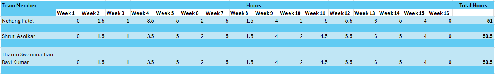

# Fall + Spring Timekeeping

This document contains all the timekeeping notes for all members for both Fall and Spring Semesters. There are tables showing our weekly hours spent on the project and following those will be weekly justifications for each team member for time spent on the project. We did all the work (planning, designing, development, testing) together in team meetings, so every member's individual hours are similar.

## Fall Semester

### Justifications for Work Done During Fall Semester

**Week 1:**  
Did not log any hours since the team was not formed at this point.

**Week 2:**  
Date: 4th September 2024  
Task: Professional biography  
Description: Completed individually.  
Total Hours: 1.5 per member  

**Week 3:**  
Date: 4th September 2024  
Task: Team Advisor and project description  
Description: Decided on team advisor and worked on project abstract.  
Total Hours: 1 per member  

**Week 4:**  
Date: 12th September 2024  
Task: Completing Project Proposal and Initial Individual Capstone Assessment  
Description: Worked on team contract, delegated roles for team members, and got it approved by the advisor. We also wrote down our Individual Assessments.  
Total Hours: 3.5 per member  

**Week 5:**  
Date: 18th September 2024  
Task: User Stories and Design Diagrams  
Description: Brainstormed user stories based on feedback and worked on coming up with meaningful features for the app. We also created top-level design diagrams outlining how the features will be integrated and how the app flow will work.  
Total Hours: 5 per member  

**Week 6:**  
Date: 24th September 2024  
Task: Creating Tasks List  
Description: We distributed initial tasks among the members based on individual skillsets and created a task list to follow for the developement phase of the project.
Total Hours: 2 per member  

**Week 7:**  
Date: 3rd October 2024  
Task: Creating Milestones and a Timeline
Description: Brainstormed our project timeline and when each phase of the project will begin and end. Created a milestones sheet for each member based on that.  
Hours: 3.5 per member  

Date: 4rd October 2024  
Task: Creating an Effort Matrix  
Description: Learnt how to create an effort matrix and made one based on our list of milestones. Assigned "story points" to each task and reassigned tasks to make each member's contribution equal.  
Hours: 1.5 per member  

Total Hours: 5 per member  

**Week 8:**  
Date: 9th October 2024  
Task: Project Constraints Essay  
Description: Researched about some of the constraints our project could face.  
Total Hours: 1.5 per member  

**Week 9:**  
Date: 18th October 2024  
Task: Slideshow - Fall Design Presentation  
Description: Discussed and prepared slides for the project presentation.  
Total Hours: 4 per member  

**Week 10:**  
Date: 25th October 2024  
Task: Presentation Video  
Description: Recorded our fall presentation.  
Total Hours: 2 per member  

**Week 11:**  
Date: 1st November 2024  
Task: Peer Review Assessments and Individual Research  
Description: Finished peer reviews and worked on initial research for development. Tharun and Shruti researched APIs and how to integrate them for their OCR and Stocks features. Nehang researched about building responsive Flutter/Dart UIs for our other pages.
Peer Review Hours: 1 per member  
Tharun's Hours: 3.5  
Nehang's Hours: 4  
Shruti's Hours: 3.5  
Total Hours: 4.5-5 depending on each member's research hours.  

**Week 12:**  
Date: 13th November 2024  
Task: Discussing Individual Research  
Description: Conducted a team meeting to go over the research done in Week 10.  
Hours: 2.5 per member  

Date: 15th November 2024  
Task: Understanding and conducting Alpha Testing on existing version of the application  
Description: Tested the skeletal version of our application to understand the current flow and user experience.  
Hours: 3 per member  

Total Hours: 5.5 per member  

**Week 13:**  
Date: 22nd November 2024  
Task: Worked on Final Design Report  
Description: Started drafting our fall final design report.  
Hours: 3.5 per member  

Date: 25th November 2024  
Task: Worked on Final Design Report  
Description: Continued working on the fall design report. Included new design diagrams supporting the added features.  
Hours: 2.5 per member  

Total Hours: 6 per member  

**Week 14:**  
Date: 3rd December 2024  
Task: Development Phase - Experimenting with Pages  
Description: Continued coding pages for the app. We had to experiment with UI and the app flow to come up with cohesive pages and UI that looks similar to our designs.
Hours: 5 per member  

**Week 15:**  
Date: 9th December 2024  
Task: Development Phase - Experimenting with Pages  
Description: Continued coding pages for the app.
Hours: 4 per member  

**Week 16:**  
Did not log any hours for finals week.  

## Spring Semester

### Justifications for Work Done During Spring Semester

**Week 1:**  
Date: 15th January 2025  
Task: Team meetup to plan for the semester
Description: Talked about our goals for the semester. Brainstormed unique features we could add to the app. We also tested each of our environments to make sure the code we had so far ran on everyone's systems.
Total Hours: 4 per member

**Week 2:**  
Date: 20th January 2025  
Task: Development Phase - Worked on making the Stocks page and OCR  
Description: Shruti worked on developing the Stocks page with the API integration. Tharun and Nehang worked on the Add Expenses page, making the expenses list more dynamic and integrating the OCR logic.  
Hours: 5 per member  

Date: 22nd January 2025  
Task: Continuing on Stocks Page and OCR  
Description: Shruti worked on initial bug fixes for the Stocks page. Nehang and Tharun continued working on perfecting the OCR logic.  
Hours: 3 per member

Total Hours: 8 per member

**Week 3:**  
Date: 28th January 2025  
Task: Stocks Page and OCR research  
Description: We researched about ways to make the OCR more user friendly by adding the ability to take a picture to give to the OCR logic, but that was not possible. We continued fixing bugs in the Stocks page.  
Hours: 4 per member

Date: 29th January 2025  
Task: Stocks Page "Favorites" feature and Tax, Debt Pages
Description: Shruti worked on creating the favorites feature on the Stocks Page. Tharun worked on starting the development of the Debt Page. Nehang started work on the Tax Page.
Hours: 4 per member

Date: 31st January 2025  
Task: Bug fixes and research for Tax page  
Description: We worked on fixing various bugs in the favorites feature of the Stocks page. We also did some research about accurate tax calculation algorithms for the Tax page.  
Hours: 3 per member

Total Hours: 11 per member  

**Week 4:**  
Date: 3rd February 2025  
Task: Continued work on Tax and Debt pages  
Description: Researched how to add different kinds of visualizations in the app for the user to see debt payments or tax calculations in an easier way. Experimented with different visualizations and tried to make them responsive.
Hours: 3.5 per member

Date: 6th February 2025  
Task: Fixed Tax logic and fixed more bugs in the Stocks page.
Description: Made sure the tax calculations made sense for different kinds of input and perfected the logic to the best of our abilities. Encountered more bugs in the Stocks page and tried different methods to fix it.  
Hours: 3 per member  

Total Hours: 6.5 per member  

**Week 5:**  
Date: 10th February 2025  
Task: Started visualizations for Stocks and Debt  
Description: Caught more data from different endpoints in the API and made dynamic visualizations for the Stocks page which update every 5mins. Created visualizations for the Debt page which were also dynamic and responsive.
Hours: 3.5 per member  

Date: 11th February 2025  
Task: Stock visualizations and bug fixes in Add Expense
Description: Tried fixing stock visualizations and make them responsive so they populate on the emulator. Encountered a new bug on Add Expense page which was duplicating expenses in the list, we started the process to fix this.
Hours: 5 per member  

Date: 14th February 2025  
Task: Bug Fixes  
Description: Continued working on the two bugs encountered in the previous meeting.
Hours: 3 per member  

Total Hours: 11.5 per member

**Week 6:**  
Date: 18th February 2025  
Task: Bug Fixing for visualizations and Add Expense list
Description: Continued working on previous bugs. Experimented different ways to workaround the bugs.  
Hours: 3 per member  

Date: 19th February 2025  
Task: Fixed add expense bugs added search feature in the Stocks page  
Description: We were able to workaround the Add Expense bug and stop the duplication of transactions. We also worked on creating the Search bar in the Stocks page to enable the user to search through the stocks list.  
Hours: 3 per member  

Date: 20th February 2025  
Task: Researched educational content, made UI updates  
Description: We spent this meeting researching educational content for our info pages and designing those pages. We also made minor UI changes, like logo changes and color changes, to make each small feature more user-friendly.  
Hours: 2.5 per member  

Total Hours: 8.5 per member

**Week 7:**  
Date: 26th February 2025  
Task: Initial Testing
Description: Completed initial testing for the app in an emulator. Found some new bugs in the stocks page and OCR.  
Hours: 2 per member

Date: 27th February 2025  
Task: Bug fixes  
Description: Fixed an OCR bug and a stocks page bug.
Hours: 2.5 per member

Total Hours: 4.5 per member

**Week 8:**  
Date: 3rd March 2025  
Task: Started drafting an initial user manual  
Description: With all pages having the initial versions of their features, we started creating the user documentation. We included directions for using each page and feature with plan to include screenshots in the future.  
Hours: 2.5 per member

Date: 5th March 2025  
Task: Started creating our Expo Poster  
Description: Searched for templates for the Expo Poster, and designed an initial poster with our project abstract, user stories, challenges, etc.  
Hours: 3 per member  

Date: 6th March 2025  
Task: Second testing round  
Description: Followed the test plan and conducted a formal testing round. We also noticed that the app flow could be better if we had a login page. Started planning how to implement that.  
Hours: 2 per member  

Total Hours: 7.5 per member

**Week 9:**  
Date: 10th March 2025  
Task: Minor bug fixes and UI updates  
Description: Fixed other minor bugs found in the second round of testing. Also made UI updates to the stocks page to show ticker name instead of company name.
Hours: 2 per member

Date: 14th March 2025  
Task: Planning meeting  
Description: Planned for post spring break tasks.
Hours: 1 per member

Total Hours: 3 per member

**Week 10:**  
Did not log any hours for Spring Break.  

**Week 11:**  
Date: 18th March 2025  
Task: Started working on user authentication  
Description: We started creating a user authentication page that enables user to log in and also created a log out button that lets the user go back to the login page from the main UI.
Hours: 4 per member  

Date: 19th March 2025  
Task: Continued Expo Poster  
Description: Made changes to the Expo Poster based on feedback received. Included screenshots of our UI to give previews. Included more information like future features, impact of our product, etc.
Hours: 3 per member

Date: 21st March 2025  
Task: Finished User Auth, started "filter" feature in the Stocks page  
Description: We finished development of the login page. We also worked towards making a filter feature in the stocks page so users can filter between stocks that are cheap/expensive, etc.  
Hours: 4 per member  

Total Hours: 11 per member

**Week 12:**  
Date: 25th March 2025  
Task: OCR bug, Taxes bug  
Description: Fixed a bug in OCR that was not picking up the right transaction amount from some of the receipts we fed to the logic. Updated tax calculation logic to fix a bug in the Taxes page that was not calculating some tax amounts correctly.
Hours: 4 per member  

Date: 27th March 2025  
Task: Splash screen, research for building the app on iOS and Android phones  
Description: Created a Splash Screen with the app logo to complete the app experience. We also researched and implemented a way to build the app on each of our phones to enhance our demo at the Expo by enabling judges and users to pick up our phones and test the app.
Hours: 4 per member

Total Hours: 8 per member

**Week 13:**  
Date: 7th April 2025  
Task: Sanity Test of App before EXPO  
Description: Tested all pages and features. Fixed bug fixes and implemented workarounds for APIs that were down. Tested everything on various devices (phones and laptops) to have everything ready for EXPO.
Hours: 4 per member  

Date: 8th April 2025  
Task: Attend CEAS EXPO  
Description: Presented our app at the EXPO.  
Hours: 6 per member

Total Hours: 10 per member  

**Week 14:**  
Date: 14th April 2025  
Task: Final Design Report  
Description: Compiled all documents and cleaned our repository. Finalized our fall design report.  
Total Hours: 2.5 per member  

**At the time of submitting this timesheet we are at Week 14.**
